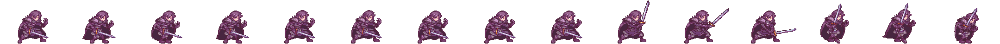
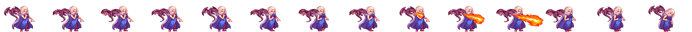
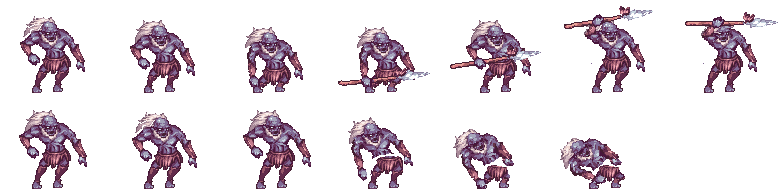
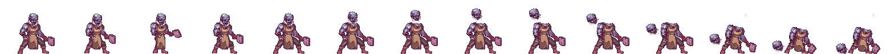
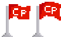

## Assets de los personajes
En este archivo veremos los distintos assets de los objetos y personajes del juego.

<u>**John**</u>  

- 1 - 4: Caminar.
- 6 - 9: Parado.
- 10 - 12: Ataque.
- 13 - 13: Salto.
- 14 - 14: Caida.
- 15 - 15: Daño.

<u>**Daenerys**</u>  

- 5 - 8: Caminar.
- 1 - 4: Parado.
- 9 - 11: Ataque.
- 13 - 13: Salto.
- 12 - 12: Caida.
- 14 - 14: Daño.

<u>**Lancero**</u>  

- 1 - 4: Parado.
- 5 - 14: Muerte.

<u>**Caminante**</u>  

- 8 - 9: Parado.
- 1 - 7: Ataque.
- 8 - 13: Muerte.

<u>**Pociones**</u>  

<u>**Checkpoint**</u>  

<u>**BarraJuego**</u>  

